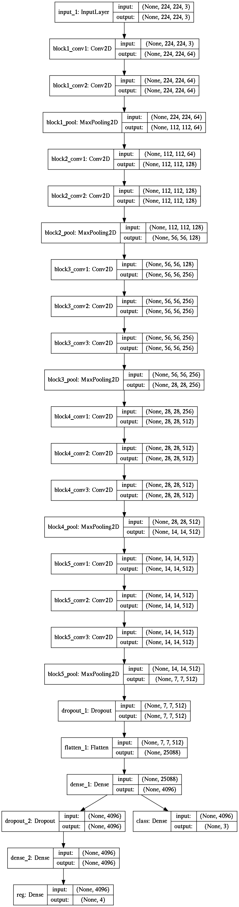
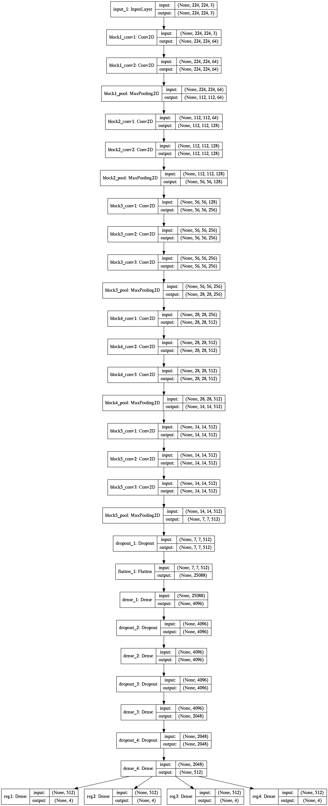

# Task-1 : Localization Problem

## Problem Statement
The task is to do the localization along with classification for the given images. With object localization the network identifies where the object is, putting a bounding box around it. Additionally, class label for particular detected object would be given by this network. In other words, the neural network will output the four numbers (for bounding box), plus the probability of class labels.

## Pre-processing

 1. **Converted all images to dimensions to 224*224 pixels using linear interpolation.** This helped in dealing with images of various dimensions available in different classes. Images were resized to (224, 224, 3). The corresponding bounding boxes coordinates were also resized accordingly.
 2.  **Resized coordinates of bounding boxes according to new image size**
>        ratio = NEW_IMAGE_SIZE/OLD_IMAGE_SIZE
>        (new_x1, new_y1) = (ratio\*x1, ratio\*y1)
 
 3. **Normalized images by dividing each pixel by 255**

## Model

I used a VGG16 as base model.
>        model=VGG16(include_top=False, weights=None, input_shape=(224,224,3))

After getting conv. layer from VGG16, I created two separate networks - one for classification and other for regression.

 - **Optimizer=Adam**
 - **Loss= {'classification':'categorical_crossentropy','regression':'mean_squared_error'}**

**Model Architecture :** 
***Part 1 (single object)***

**Model Architecture :** 
***Part 2 (multiple object)***
